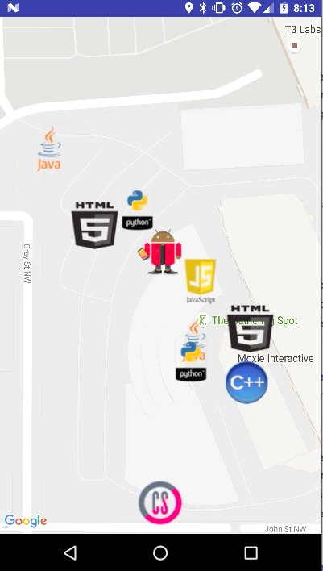
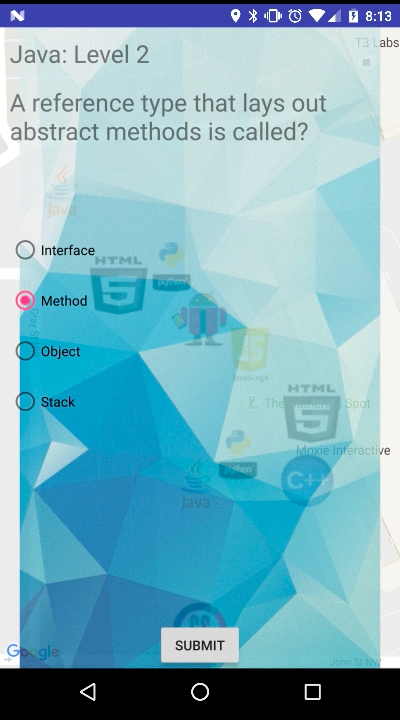

# Google-ATL-Hack-2016
Project for Google Atlanta Hackathon 2016

!Competed in a Google hosted hackathon against over 30 other teams from 7 different schools.
!Presented the app to a panel of Google Engineers and received Honorable Mention.
!The app uses the Google Maps API to find the user’s location, and generate random markers on a map.
!Inspired by Pokemon GO, the app was intended to ask Computer Science questions to help with technical interviews.

